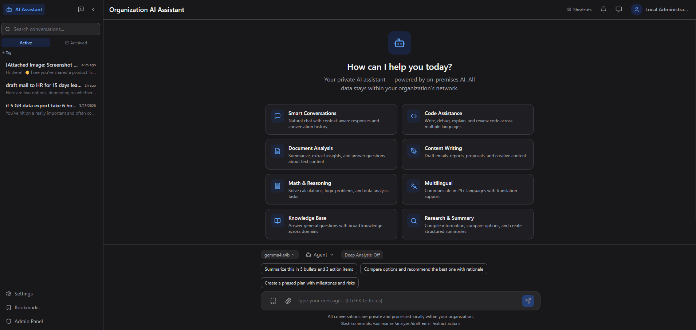
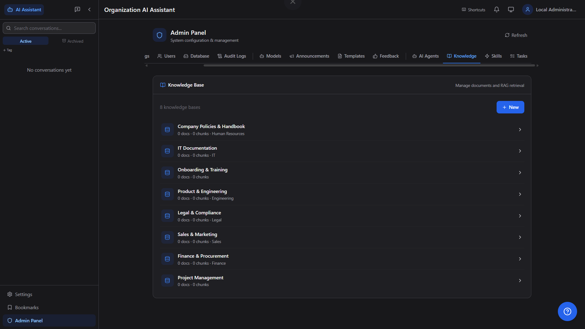
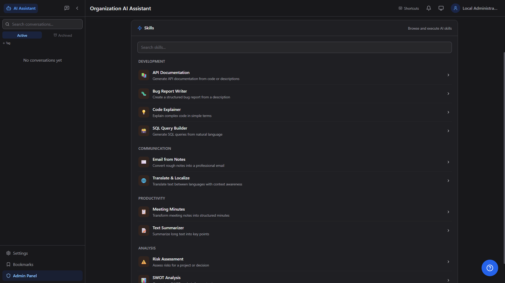
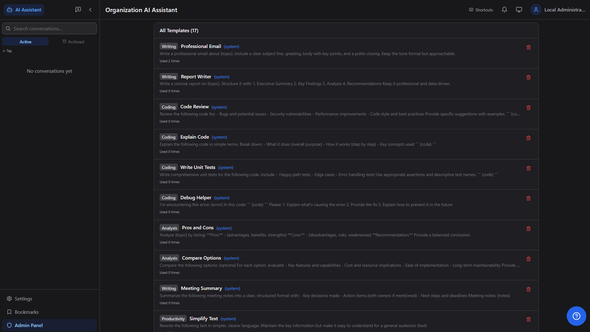

<div align="center">

# Organization AI Assistant

### The Private, Enterprise-Grade AI Portal That Runs Entirely On Your Hardware

[](LICENSE)
[](https://python.org)
[](https://fastapi.tiangolo.com)
[](https://react.dev)
[](https://typescriptlang.org)
[](https://postgresql.org)
[](https://ollama.ai)

**Zero data leakage** · **Active Directory SSO** · **200+ users** · **Your hardware, your models**

[Live Landing Page](https://sagarsorathiya.github.io/Organization_AI/) · [Deployment Guide](DEPLOYMENT_GUIDE.md) · [Requirements](Requirement.md) · [Report Issue](https://github.com/sagarsorathiya/Organization_AI/issues)

</div>

---

<div align="center">

<br><em>Dashboard — 8 AI capability cards, model & agent selectors, real-time streaming</em>
</div>

---

## Why Organization AI?

| | Traditional Cloud AI | Organization AI |
|---|---|---|
| **Data Privacy** | Data sent to third-party servers | 100% on-premises — nothing leaves your network |
| **Authentication** | Separate credentials | Active Directory / LDAP SSO |
| **Cost** | Per-token pricing | One-time hardware — unlimited usage |
| **Customization** | Limited | Full control: agents, skills, RAG, templates |
| **Compliance** | Depends on provider | Fully auditable, air-gap ready |

---

## Screenshots

<table>
<tr>
<td width="50%"><br><b>Login</b> — Dark themed with on-premise badge</td>
<td width="50%"><br><b>Chat</b> — Streaming, toolbar, export (.md/.pdf)</td>
</tr>
<tr>
<td><br><b>AI Agents</b> — 10+ agent personas with categories</td>
<td><br><b>Knowledge Base</b> — RAG with local embeddings</td>
</tr>
<tr>
<td><br><b>Skills</b> — Prompt chains across 4 categories</td>
<td><br><b>Templates</b> — 17 templates (Writing/Coding/Analysis)</td>
</tr>
<tr>
<td><br><b>Admin Settings</b> — LDAP config, security, help button</td>
<td><br><b>Database</b> — 31 tables, export/import, PostgreSQL 18</td>
</tr>
<tr>
<td colspan="2" align="center"><br><b>Health Report</b> — System, Database, LLM status at a glance</td>
</tr>
</table>

---

## Features

### Core Platform
- **Private & Secure** — All AI inference runs locally via [Ollama](https://ollama.ai). Zero cloud dependency.
- **Active Directory / LDAP** — Authenticate users against your existing AD/LDAP directory.
- **Multi-Model Support** — 27 popular models cataloged; download, update, and delete from the admin panel.
- **Admin Panel** — 15 tabs in 3 groups (System, Content, AI & Automation), including an Eval Dashboard for request traces and approval workflows.
- **Streaming Responses** — Real-time token streaming with optimized rendering.
- **Full-Text Search** — PostgreSQL-powered search across all conversations and messages.
- **Custom System Prompts** — Per-user customizable AI behavior and preferences.
- **Dark / Light / System Theme** — User-selectable theme with system auto-detection.
- **Database Management** — Admin tools for export (JSON/ZIP), import, schema inspection, and data maintenance across all 31 tables.
- **Eval Dashboard** — Admin observability for latency, quality flags, model distribution, request timelines, and execution governance.
- **Trace Timeline** — Per-request phase timeline (prompt, model routing, retrieval, draft/refine, completion) for troubleshooting and QA.
- **Approval-Gated Actions** — Idempotency-keyed action requests with approve/reject/execute controls and full auditability.
- **One-Click Setup** — Automated setup scripts for Windows (`setup.ps1`) and Linux (`setup.sh`).
- **Scales to 200+ Users** — Configurable connection pools, worker counts, and GPU acceleration.
- **Hardware-Agnostic** — Works on CPU-only servers, GPU servers, or mixed environments.
- **Progressive Web App (PWA)** — Installable with service worker, offline cache, and standalone display.

### Enterprise Features
- **AI Agents** — Custom agent personas with system prompts, temperature, model, category, icon, and knowledge base linking. Per-conversation agent selection.
- **Knowledge Base / RAG** — 100% local embeddings via Ollama (nomic-embed-text). Upload 13 document formats, configurable chunking, vector similarity search, department-scoped access.
- **Skills Engine** — Prompt chains, templates, and extraction skills with multi-step definitions, input schemas, execution tracking, and agent linking.
- **Memory System** — Scoped memories (user/department/organization) with categories (preference, fact, context, skill), confidence scoring, expiration.
- **Prompt Templates** — Admin-curated prompt library with categories; users can browse and apply templates in chat.
- **Response Feedback (👍/👎)** — Rate AI responses; admins view aggregated feedback stats and satisfaction metrics.
- **Multi-File Attachments** — Upload multiple files (14+ formats: PDF, DOCX, XLSX, PPTX, CSV, etc.) in a single message.
- **Conversation Management** — Pin, archive, export (.md/.pdf), rename, tag, and share conversations.
- **Background Tasks / Scheduler** — Cron-based scheduling via APScheduler with timezone support, run-now trigger, execution logs.
- **Notifications** — In-app notifications (info/warning/task_result/alert) with unread badge and notification bell.
- **Read-Only Sharing** — Generate shareable links for conversations; accessible without authentication.
- **Message Bookmarks** — Bookmark important messages and access them from a dedicated bookmarks page.
- **Keyboard Shortcuts** — Quick-reference modal for all keyboard shortcuts.
- **User Usage Dashboard** — Personal stats: total conversations, messages, monthly activity, top model, uploads.
- **Onboarding Tour** — Interactive first-time walkthrough highlighting key features.
- **Admin Password Reset** — Reset passwords for local user accounts from the admin panel.
- **Bulk Export** — Download all conversations as a ZIP archive.
- **Data Retention** — Automatic cleanup based on admin-configured retention policies.
- **Announcements** — Admin-created banners displayed to all users.
- **Feature Flags** — 6 toggles (agents, memory, skills, RAG, scheduler, notifications) for modular enablement.
- **Organization Structure** — Companies, departments, and designations with many-to-many mapping. First-login profile setup dialog for AD users, settings page org profile section.

---

## Project Stats

| Metric | Value |
|--------|-------|
| **Features** | 45+ |
| **API Endpoints** | 146+ across 18 route files |
| **Database Tables** | 31 (14 core + 10 AI/automation + 5 organization + 2 eval/governance) |
| **Alembic Migrations** | 14 |
| **Backend Services** | 13 (6 core + 6 AI + 1 org) |
| **Frontend Stores** | 12 (Zustand) |
| **Admin Panel Tabs** | 15 in 3 groups |
| **Feature Flags** | 6 |

---

## Quick Start

### Prerequisites

| Component    | Version  | Purpose              |
|-------------|----------|----------------------|
| Python      | 3.12+    | Backend runtime      |
| Node.js     | 20 LTS   | Frontend build       |
| PostgreSQL  | 16+      | Database             |
| Ollama      | Latest   | Local LLM runtime    |

### One-Click Setup

```powershell
# Windows
.\setup.ps1
```

```bash
# Linux / macOS
chmod +x setup.sh && ./setup.sh
```

### Manual Setup

#### 1. Clone & Configure

```bash
git clone https://github.com/sagarsorathiya/Organization_AI.git
cd Organization_AI
cp .env.example .env
# Edit .env — set DATABASE_PASSWORD, SECRET_KEY, SESSION_SECRET at minimum
```

#### 2. Database

```bash
createdb -U postgres org_ai
```

#### 3. Backend

```bash
cd backend
python -m venv .venv
.venv\Scripts\activate        # Windows
# source .venv/bin/activate   # Linux

pip install -r requirements.txt
alembic upgrade head
uvicorn app.main:app --reload --port 8000
```

#### 4. Frontend

```bash
cd frontend
npm install
npm run dev
```

#### 5. Ollama

```bash
ollama pull gemma3:4b     # Lightweight, great for most tasks
ollama serve              # Runs on port 11434
```

#### 6. Access

Open **http://localhost:3005** in your browser.  
Development mode: any username/password works, user `admin` gets admin rights.

---

## Production Deployment

### Docker Compose (Recommended)

```bash
cp .env.example .env
# Configure .env for production

# CPU-only
docker compose up -d

# With NVIDIA GPU
docker compose -f docker-compose.yml -f docker-compose.gpu.yml up -d
```

### Manual Deployment

```bash
# Backend
cd backend
pip install -r requirements.txt
alembic upgrade head
uvicorn app.main:app --host 0.0.0.0 --port 8000 --workers 16

# Frontend
cd frontend
npm run build
# Serve dist/ with Nginx or IIS
```

### Reverse Proxy

Copy `deployment/nginx.conf` and adjust server name, SSL, and upstream addresses.

---

## Active Directory Configuration

```env
# LDAP Mode
AD_ENABLED=true
AD_SERVER=ldap://dc01.corp.local
AD_PORT=389
AD_USE_SSL=false
AD_DOMAIN=CORP
AD_BASE_DN=DC=corp,DC=local
AD_USER_SEARCH_BASE=OU=Users,DC=corp,DC=local
AD_BIND_USER=CN=svc_ai,OU=ServiceAccounts,DC=corp,DC=local
AD_BIND_PASSWORD=<service_account_password>
AD_ADMIN_GROUP=CN=AI-Admins,OU=Groups,DC=corp,DC=local

# LDAPS (Encrypted)
AD_SERVER=ldaps://dc01.corp.local
AD_PORT=636
AD_USE_SSL=true

# Development (No AD)
AD_ENABLED=false
```

---

## Architecture

```
┌──────────────────────────────────────────────────────┐
│                    Internal Network                   │
│                                                       │
│  ┌──────────┐   ┌──────────┐   ┌──────────────────┐ │
│  │ Browser  │──▶│  Nginx   │──▶│    FastAPI        │ │
│  │ (React   │   │ (Reverse │   │    Backend        │ │
│  │  PWA)    │   │  Proxy)  │   │   (13 services)   │ │
│  └──────────┘   └──────────┘   │                    │ │
│                                 │  ┌──────────────┐ │ │
│  ┌──────────┐                  │  │ Auth (LDAP)  │ │ │
│  │ Active   │◀─────────────────│  └──────────────┘ │ │
│  │Directory │                  │  ┌──────────────┐ │ │
│  └──────────┘                  │  │ Org / Agents │ │ │
│                                 │  │ Memory /     │ │ │
│  ┌──────────┐                  │  │ Skills / RAG │ │ │
│  │PostgreSQL│◀─────────────────│  └──────────────┘ │ │
│  │ 31 tables│                  │  ┌──────────────┐ │ │
│  └──────────┘                  │  │ Scheduler /  │ │ │
│                                 │  │ Notifications│ │ │
│  ┌──────────┐                  │  └──────────────┘ │ │
│  │ Ollama   │◀─────────────────│                    │ │
│  │ LLM +    │                  └──────────────────┘ │
│  │ Embeddings│                                       │
│  └──────────┘         ❌ No Internet Access          │
└──────────────────────────────────────────────────────┘
```

---

## Scaling Guide

| Users   | CPU   | RAM    | GPU           | Model              | Workers |
|---------|-------|--------|---------------|--------------------|---------| 
| 1–30    | 4+    | 16 GB  | Optional      | `gemma3:4b`        | 4       |
| 30–80   | 8+    | 32 GB  | 4+ GB VRAM    | `gemma3:4b`        | 8       |
| 80–200  | 16+   | 64 GB  | 8+ GB VRAM    | `llama3.1:8b`      | 12      |
| 200+    | 32+   | 128 GB | 16+ GB VRAM   | `llama3.1:8b`      | 16      |

See [.env.example](.env.example) for all tuning parameters.

---

## Security Checklist

- [ ] Change `SECRET_KEY` and `SESSION_SECRET` to random 64-char strings
- [ ] Set `APP_ENV=production` (disables Swagger docs)
- [ ] Enable `SESSION_COOKIE_SECURE=true` (requires HTTPS)
- [ ] Configure AD bind account with minimal read-only permissions
- [ ] Set up SSL certificates from internal CA
- [ ] Block all outbound internet from the server
- [ ] Restrict database access to backend server only
- [ ] Set up log rotation for `logs/app.log`

---

## API Endpoints

<details>
<summary><strong>Authentication</strong> (4 endpoints)</summary>

| Method | Endpoint                    | Description              | Auth     |
|--------|-----------------------------|--------------------------|----------|
| POST   | /api/auth/login             | Authenticate via AD/local | Public   |
| POST   | /api/auth/logout            | Clear session            | Required |
| GET    | /api/auth/me                | Current user info        | Required |
| POST   | /api/auth/change-password   | Change password (local)  | Required |

</details>

<details>
<summary><strong>Chat</strong> (8 endpoints)</summary>

| Method | Endpoint                      | Description              | Auth     |
|--------|-------------------------------|--------------------------|----------|
| POST   | /api/chat                     | Send message (sync)      | Required |
| POST   | /api/chat/stream              | Send message (streaming) | Required |
| POST   | /api/chat/search              | Search messages          | Required |
| GET    | /api/chat/models              | List available models    | Required |
| GET    | /api/chat/attachments-enabled | Check attachment status  | Required |
| POST   | /api/chat/upload              | Upload single file       | Required |
| POST   | /api/chat/upload-multiple     | Upload multiple files    | Required |
| POST   | /api/chat/regenerate          | Regenerate last response | Required |

</details>

<details>
<summary><strong>Conversations</strong> (9 endpoints)</summary>

| Method | Endpoint                         | Description              | Auth     |
|--------|----------------------------------|--------------------------|----------|
| GET    | /api/conversations               | List conversations       | Required |
| POST   | /api/conversations               | Create conversation      | Required |
| GET    | /api/conversations/:id           | Get with messages        | Required |
| PATCH  | /api/conversations/:id           | Rename                   | Required |
| DELETE | /api/conversations/:id           | Delete                   | Required |
| PATCH  | /api/conversations/:id/pin       | Pin/unpin                | Required |
| PATCH  | /api/conversations/:id/archive   | Archive                  | Required |
| GET    | /api/conversations/:id/export    | Export conversation      | Required |
| GET    | /api/conversations/export-all    | Bulk export all (ZIP)    | Required |

</details>

<details>
<summary><strong>Settings & Feedback</strong> (8 endpoints)</summary>

| Method | Endpoint                           | Description              | Auth     |
|--------|------------------------------------|--------------------------|----------|
| GET    | /api/settings                      | Get user settings        | Required |
| PATCH  | /api/settings                      | Update user settings     | Required |
| GET    | /api/settings/stats                | User usage statistics    | Required |
| POST   | /api/feedback                      | Submit feedback (👍/👎)  | Required |
| DELETE | /api/feedback/:id                  | Remove feedback          | Required |
| GET    | /api/feedback/message/:id          | Get message feedback     | Required |
| GET    | /api/feedback/conversation/:id     | Conversation feedback    | Required |
| GET    | /api/feedback/stats                | Feedback statistics      | Admin    |

</details>

<details>
<summary><strong>Templates, Tags & Bookmarks</strong> (18 endpoints)</summary>

| Method | Endpoint                       | Description              | Auth     |
|--------|--------------------------------|--------------------------|----------|
| GET    | /api/templates                 | List all templates       | Required |
| GET    | /api/templates/categories      | List categories          | Required |
| POST   | /api/templates/use/:id         | Record template usage    | Required |
| POST   | /api/templates                 | Create template          | Admin    |
| PATCH  | /api/templates/:id             | Update template          | Admin    |
| DELETE | /api/templates/:id             | Delete template          | Admin    |
| GET    | /api/tags                      | List user's tags         | Required |
| POST   | /api/tags                      | Create tag               | Required |
| DELETE | /api/tags/:id                  | Delete tag               | Required |
| POST   | /api/tags/link                 | Link tag to conversation | Required |
| DELETE | /api/tags/link                 | Unlink tag               | Required |
| GET    | /api/tags/conversation/:id     | Tags for conversation    | Required |
| GET    | /api/tags/:id/conversations    | Conversations for tag    | Required |
| GET    | /api/bookmarks                 | List bookmarks           | Required |
| POST   | /api/bookmarks                 | Create bookmark          | Required |
| DELETE | /api/bookmarks/:id             | Delete bookmark          | Required |
| DELETE | /api/bookmarks/message/:id     | Remove by message ID     | Required |
| GET    | /api/bookmarks/check/:id       | Check if bookmarked      | Required |

</details>

<details>
<summary><strong>Announcements & Sharing</strong> (9 endpoints)</summary>

| Method | Endpoint                          | Description              | Auth     |
|--------|-----------------------------------|--------------------------|----------|
| GET    | /api/announcements                | Active announcements     | Required |
| GET    | /api/announcements/all            | All announcements        | Admin    |
| POST   | /api/announcements                | Create announcement      | Admin    |
| PATCH  | /api/announcements/:id/toggle     | Toggle active/inactive   | Admin    |
| DELETE | /api/announcements/:id            | Delete announcement      | Admin    |
| POST   | /api/sharing/create               | Create shared link       | Required |
| GET    | /api/sharing/:token               | View shared conversation | Public   |
| DELETE | /api/sharing/:id                  | Revoke shared link       | Required |
| GET    | /api/sharing/check/:id            | Check sharing status     | Required |

</details>

<details>
<summary><strong>Admin</strong> (25 endpoints)</summary>

| Method | Endpoint                          | Description              | Auth     |
|--------|-----------------------------------|--------------------------|----------|
| GET    | /api/admin/health                 | System health            | Admin    |
| GET    | /api/admin/metrics                | Usage metrics            | Admin    |
| GET    | /api/admin/settings               | Get system settings      | Admin    |
| PATCH  | /api/admin/settings               | Update system settings   | Admin    |
| POST   | /api/admin/test-ldap              | Test LDAP connection     | Admin    |
| GET    | /api/admin/users                  | List users               | Admin    |
| POST   | /api/admin/users                  | Create new user          | Admin    |
| PATCH  | /api/admin/users/:id              | Update user              | Admin    |
| GET    | /api/admin/audit-logs             | View audit logs          | Admin    |
| GET    | /api/admin/models                 | List LLM models          | Admin    |
| POST   | /api/admin/models/pull            | Download model           | Admin    |
| DELETE | /api/admin/models/:name           | Delete model             | Admin    |
| POST   | /api/admin/models/set-default     | Set default model        | Admin    |
| GET    | /api/admin/database/info          | Database schema info     | Admin    |
| GET    | /api/admin/database/export        | Export data              | Admin    |
| POST   | /api/admin/database/import        | Import data              | Admin    |
| DELETE | /api/admin/database/clear/:table  | Clear table data         | Admin    |
| DELETE | /api/admin/database/clear-all     | Clear all data           | Admin    |
| GET    | /api/admin/eval/summary           | Eval metrics summary     | Admin    |
| GET    | /api/admin/eval/traces            | Request trace timelines  | Admin    |
| GET    | /api/admin/eval/actions           | List action requests     | Admin    |
| POST   | /api/admin/eval/actions/request   | Create idempotent action | Admin    |
| POST   | /api/admin/eval/actions/:id/approve | Approve action request | Admin    |
| POST   | /api/admin/eval/actions/:id/reject  | Reject action request  | Admin    |
| POST   | /api/admin/eval/actions/:id/execute | Execute approved action | Admin    |

</details>

<details>
<summary><strong>Organization</strong> (20 endpoints)</summary>

| Method | Endpoint                                      | Description                    | Auth     |
|--------|-----------------------------------------------|--------------------------------|----------|
| GET    | /api/org/companies                            | List active companies          | Required |
| GET    | /api/org/departments                          | Departments for a company      | Required |
| GET    | /api/org/designations                         | Designations for a department  | Required |
| POST   | /api/org/profile-setup                        | First-login profile setup      | Required |
| PATCH  | /api/org/profile                              | Update org profile             | Required |
| GET    | /api/admin/org/companies                      | List all companies             | Admin    |
| POST   | /api/admin/org/companies                      | Create company                 | Admin    |
| PUT    | /api/admin/org/companies/:id                  | Update company                 | Admin    |
| DELETE | /api/admin/org/companies/:id                  | Delete company                 | Admin    |
| PUT    | /api/admin/org/companies/:id/departments      | Map departments to company     | Admin    |
| GET    | /api/admin/org/departments                    | List all departments           | Admin    |
| POST   | /api/admin/org/departments                    | Create department              | Admin    |
| PUT    | /api/admin/org/departments/:id                | Update department              | Admin    |
| DELETE | /api/admin/org/departments/:id                | Delete department              | Admin    |
| PUT    | /api/admin/org/departments/:id/designations   | Map designations to department | Admin    |
| GET    | /api/admin/org/designations                   | List all designations          | Admin    |
| POST   | /api/admin/org/designations                   | Create designation             | Admin    |
| PUT    | /api/admin/org/designations/:id               | Update designation             | Admin    |
| DELETE | /api/admin/org/designations/:id               | Delete designation             | Admin    |
| GET    | /api/admin/org/stats                          | Organization statistics        | Admin    |

</details>

<details>
<summary><strong>AI Agents</strong> (8 endpoints)</summary>

| Method | Endpoint                          | Description              | Auth     |
|--------|-----------------------------------|--------------------------|----------|
| GET    | /api/agents                       | List available agents    | Required |
| GET    | /api/agents/:id                   | Get agent details        | Required |
| GET    | /api/admin/agents                 | List all agents (admin)  | Admin    |
| POST   | /api/admin/agents                 | Create agent             | Admin    |
| PUT    | /api/admin/agents/:id             | Update agent             | Admin    |
| DELETE | /api/admin/agents/:id             | Delete agent             | Admin    |
| POST   | /api/admin/agents/:id/duplicate   | Duplicate agent          | Admin    |
| PATCH  | /api/admin/agents/:id/toggle      | Toggle active/inactive   | Admin    |

</details>

<details>
<summary><strong>Memory</strong> (7 endpoints)</summary>

| Method | Endpoint                          | Description              | Auth     |
|--------|-----------------------------------|--------------------------|----------|
| GET    | /api/memory                       | List user memories       | Required |
| POST   | /api/memory                       | Create memory            | Required |
| PUT    | /api/memory/:id                   | Update memory            | Required |
| DELETE | /api/memory/:id                   | Delete memory            | Required |
| GET    | /api/memory/search                | Search memories          | Required |
| GET    | /api/admin/memory                 | List dept/org memories   | Admin    |
| POST   | /api/admin/memory                 | Create dept/org memory   | Admin    |

</details>

<details>
<summary><strong>Skills</strong> (8 endpoints)</summary>

| Method | Endpoint                          | Description              | Auth     |
|--------|-----------------------------------|--------------------------|----------|
| GET    | /api/skills                       | List available skills    | Required |
| GET    | /api/skills/:id                   | Get skill details        | Required |
| POST   | /api/skills/:id/execute           | Execute a skill          | Required |
| GET    | /api/skills/:id/executions        | Execution history        | Required |
| GET    | /api/admin/skills                 | List all skills (admin)  | Admin    |
| POST   | /api/admin/skills                 | Create skill             | Admin    |
| PUT    | /api/admin/skills/:id             | Update skill             | Admin    |
| DELETE | /api/admin/skills/:id             | Delete skill             | Admin    |

</details>

<details>
<summary><strong>Knowledge Base / RAG</strong> (11 endpoints)</summary>

| Method | Endpoint                              | Description              | Auth     |
|--------|---------------------------------------|--------------------------|----------|
| GET    | /api/admin/knowledge                  | List knowledge bases     | Admin    |
| POST   | /api/admin/knowledge                  | Create knowledge base    | Admin    |
| PUT    | /api/admin/knowledge/:id              | Update knowledge base    | Admin    |
| DELETE | /api/admin/knowledge/:id              | Delete knowledge base    | Admin    |
| GET    | /api/admin/knowledge/:id/documents    | List documents           | Admin    |
| POST   | /api/admin/knowledge/:id/documents    | Upload document          | Admin    |
| DELETE | /api/admin/knowledge/documents/:id    | Delete document          | Admin    |
| POST   | /api/admin/knowledge/:id/sync         | Re-embed all documents   | Admin    |
| POST   | /api/admin/knowledge/search           | Vector similarity search | Admin    |
| GET    | /api/admin/knowledge/:id/stats        | Knowledge base stats     | Admin    |
| POST   | /api/admin/knowledge/:id/query        | Query knowledge base     | Admin    |

</details>

<details>
<summary><strong>Tasks & Notifications</strong> (10 endpoints)</summary>

| Method | Endpoint                              | Description              | Auth     |
|--------|---------------------------------------|--------------------------|----------|
| GET    | /api/admin/tasks                      | List scheduled tasks     | Admin    |
| POST   | /api/admin/tasks                      | Create task              | Admin    |
| PUT    | /api/admin/tasks/:id                  | Update task              | Admin    |
| DELETE | /api/admin/tasks/:id                  | Delete task              | Admin    |
| POST   | /api/admin/tasks/:id/run              | Run task now             | Admin    |
| PATCH  | /api/admin/tasks/:id/toggle           | Toggle enabled/disabled  | Admin    |
| GET    | /api/admin/tasks/:id/executions       | Task execution history   | Admin    |
| GET    | /api/notifications                    | List notifications       | Required |
| PATCH  | /api/notifications/:id/read           | Mark as read             | Required |
| POST   | /api/notifications/read-all           | Mark all as read         | Required |

</details>

<details>
<summary><strong>Health</strong> (1 endpoint)</summary>

| Method | Endpoint       | Description        | Auth   |
|--------|----------------|--------------------|--------|
| GET    | /api/health    | Service health check | Public |

</details>

---

## Documentation

| Document | Description |
|----------|-------------|
| [Landing Page](https://sagarsorathiya.github.io/Organization_AI/) | Interactive feature showcase with screenshots |
| [DEPLOYMENT.md](DEPLOYMENT.md) | Docker-based production deployment |
| [DEPLOYMENT_WITHOUT_DOCKER.md](DEPLOYMENT_WITHOUT_DOCKER.md) | Bare-metal / VM deployment |
| [DEPLOYMENT_GUIDE.md](DEPLOYMENT_GUIDE.md) | Step-by-step server setup guide |
| [LAPTOP_TESTING_GUIDE.md](LAPTOP_TESTING_GUIDE.md) | Windows laptop testing walkthrough |
| [Requirement.md](Requirement.md) | Full project requirements & feature specs |
| [.env.example](.env.example) | All configuration options with documentation |
| [setup.ps1](setup.ps1) | One-click setup for Windows |
| [setup.sh](setup.sh) | One-click setup for Linux / macOS |

---

## Contributing

1. Fork the repository
2. Create a feature branch (`git checkout -b feature/my-feature`)
3. Commit your changes (`git commit -am 'Add my feature'`)
4. Push to the branch (`git push origin feature/my-feature`)
5. Open a Pull Request

---

## License

This project is licensed under the MIT License — see [LICENSE](LICENSE) for details.
